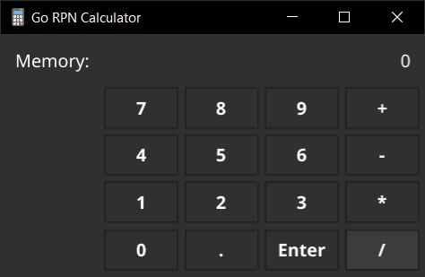

# Go RPN Calculator

An over-engineered RPN calculator built to practice unit testing, error reporting, GUI development, and CLI in Go.

## CLI

To run the command line interface of the Go RPN Calculator, go to folder `cli` and run `go run cli.go` or `go build`.

## GUI

### Fyne

A GUI version of the calculator made with the free and open source [fyne](https://fyne.io/) toolkit.

Compile with `go build -o gorpn.exe gui/fyne/main.go`. Remember that you will have to provide a GNU C++ compiler (in Windows you can use [MSYS2](https://www.msys2.org/) to provide GCC).

Calculator icons created by [Freepik - Flaticon](https://www.flaticon.com/free-icons/calculator).
## Testing

Run tests with `go test ./stack ./calculator ./operations -v` command in the root directory.
